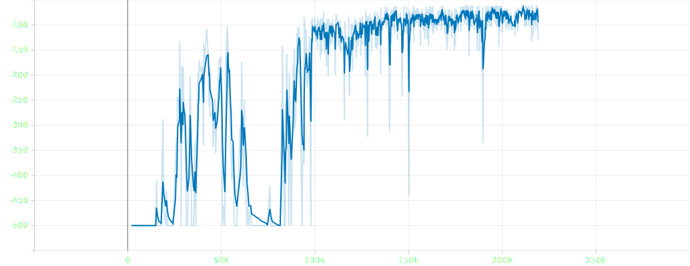
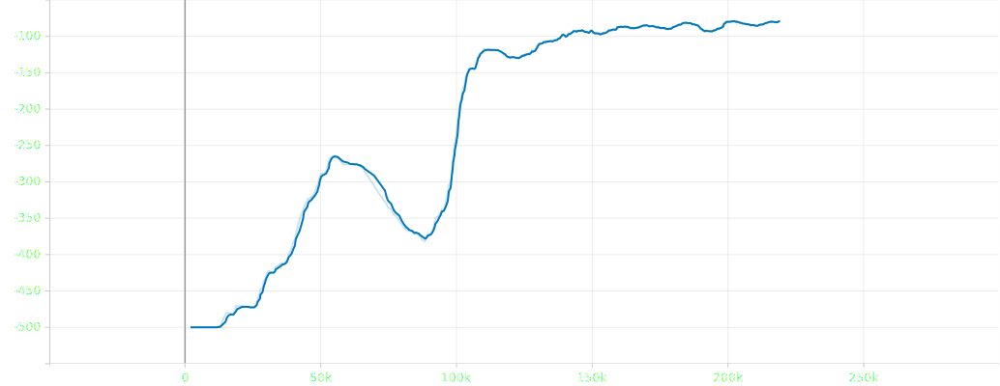

# DQN Agent for Acrobot-v1

Deep Q-Network (DQN) implementation to solve the Acrobot-v1 environment from Gymnasium.

## Requirements
- Python 3.8+
- gymnasium
- torch
- numpy
- tensorboard

## Installation
```bash
pip install gymnasium torch numpy tensorboard
```

## Usage

### Training the Agent
```bash
python main.py
```
- Model checkpoints will be saved in `./model_saves/`
- Training metrics logged to TensorBoard

### Testing the Trained Model
```bash
python play.py
```
Visualizes the trained agent interacting with the environment using human rendering mode.

## File Structure
- `main.py`: Training script with experience replay and target network
- `play.py`: Visualization script for trained model
- `dqn_model.py`: Neural network architecture definition

## Training Details
- **Network Architecture**: 
  ```python
  FC(obs_size->64) → ReLU → FC(64->128) → ReLU → FC(128->64) → ReLU → FC(64->n_actions)
  ```
- **Hyperparameters**:
  - γ (discount factor): 0.99
  - Replay buffer size: 5000
  - Batch size: 64
  - Learning rate: 3e-4
  - ε decay: 50000 frames (1.0 → 0.01)

## Results
- Solved environment in ~180,000 iterations
- Average reward (last 100 episodes): -79
- Target reward threshold: -100
- Training graphs included:
  1. Reward
  
  2. Mean reward over last 100 episodes
  

## Notes
1. **MPS/CUDA Compatibility**:
   - Default device set to MPS (Apple Silicon)
   - For CUDA users:
     ```python
     DEVICE = torch.device('cuda' if torch.cuda.is_available() else 'cpu')
     ```
     Replace `torch.mps.empty_cache()` with `torch.cuda.empty_cache()` <br>
     Ensure CUDA-compatible PyTorch version is installed

2. **Memory Management**:
   - Automatic cache clearing every 1000 iterations
   - Manually reduce batch size if memory issues occur

3. **Performance**:
   - Final agent achieves consistent scores above -100
   - Action distribution shows clear preference for optimal moves

---

*README.md generated by AI assistant. Model trained using PyTorch MPS acceleration. Training metrics and agent behavior were observed on Apple Silicon hardware.*